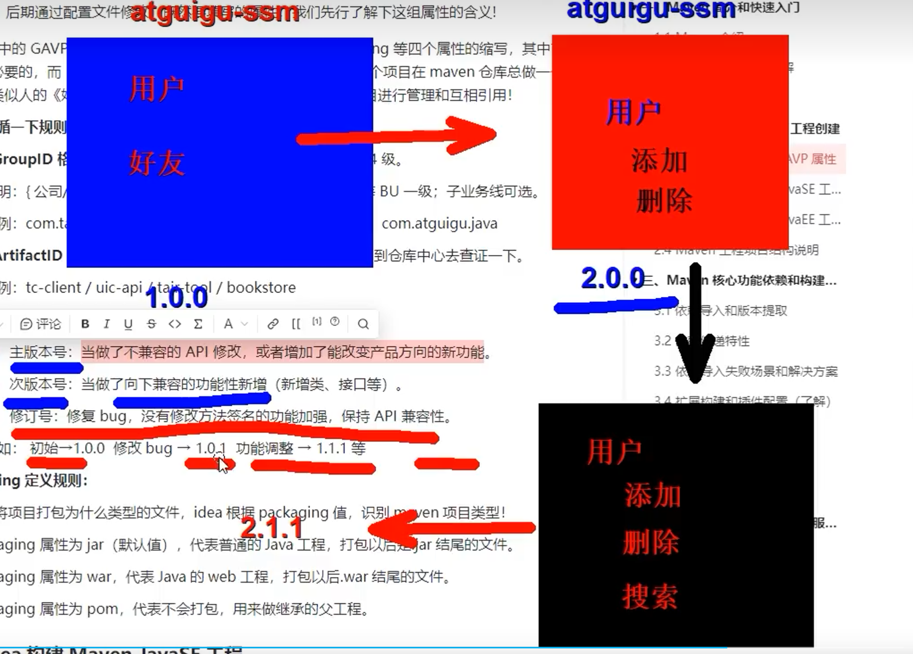

https://www.wolai.com/v5Kuct5ZtPeVBk4NBUGBWF

依赖管理、项目构建管理


maven构建相比于开发工具构建的优点：

1. maven构建触发方便（命令：打包 mvn package || 引入开发工具，进行可视化操作）
2. 构建要求项目结构（使用maven作为专门的项目构建工具，可以形成统一的项目格式，让我们不再局限于开发工具所形成的项目结构，方便最后的进行统一的打包部署）【在使用maven之前，项目构建过程是由开发工具进行的，开发工具帮助我们进行项目构建，但是每一个开发工具所构建的格式不同，没有一个同时的格式。之后我们一旦使用maven进行项目构建，构建的项目将形成一个统一的格式，方便我们进行项目的构建部署，以及项目后期的维护，你用什么开发工具打开都是一样的结构。使用maven后，idea就成为了一个代码提示工具。】

SSM框架不是java原生的，而是第三方库，如果我们没有学习maven，就需要和之前一样，来回在网上下载、导入jar包，还需要考虑版本依赖的问题，麻烦。

## 参与项目构建的过程




mvn install是将该项目部署到本地仓库中，这样你的其他项目就可以通过本地仓库进行引用了

ctrl+shift+M进行jar包资源对应信息的搜索

## 父子工程的关系：

Maven工程继承关系：如何解决module模块的继承关系。【pom.xml文件】


```XML
<!--仅仅声明依赖，并导入依赖，如果是父工程，其所有的子工程都将导入依赖-->
<dependencies></dependencies>
<!--仅仅声明依赖，并不导入依赖-->
<dependencyManagement></dependencyManagement>
```

子工程可以继承父工程的依赖信息，子工程如果需要引用对应的依赖，仅仅只需要在依赖中书写ga就可以了，版本号自动继承父工程中的信息。如果子工程中书写版本信息，那么会将父工程版本信息覆盖，直接引入子工程中写入相应版本号的依赖。

## 聚合关系的实现和作用

一般情况下，继承和聚合同时存在。有继承就有聚合。

同时。maven也给程序员灵活控制的方式，如果仅仅想要继承，不进行聚合，可以在moudles标签中进行管理。

## maven实战：

```XML
<!-- 在配置文件里面书写相关的版本信息 -->
<properties>
<spring.version>10.1.5</spring.version>
</properties>

<!-- 使用 -->
<groupId></groupId>
<artifactId></artifactId>
<!-- <version></version> -->
```

## 总结：

继承是用父工程统一管理子工程的版本，我们在子工程引入依赖的时候，只需要ga，不需要指定version

聚合是简化构建的过程,有了聚合以后不需要在子工程中一个一个构建了，直接构建父工程即可。