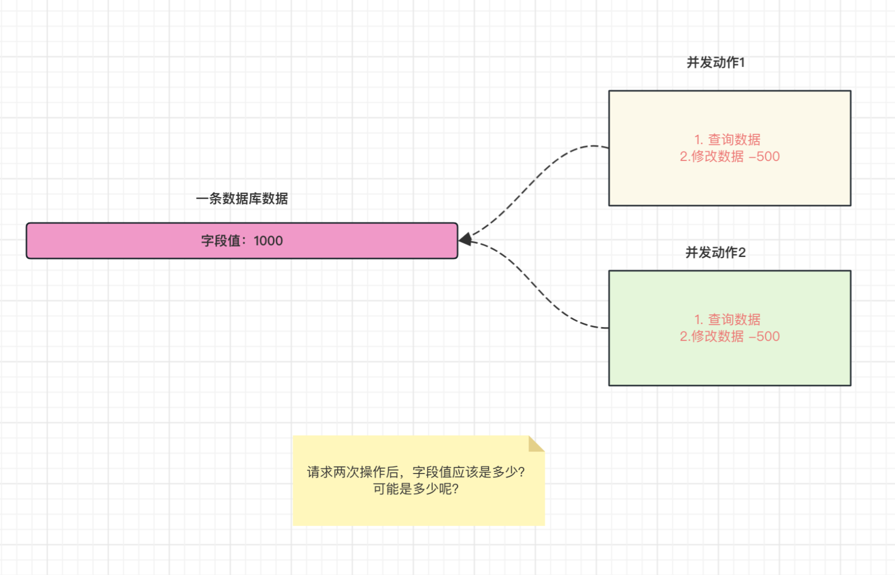
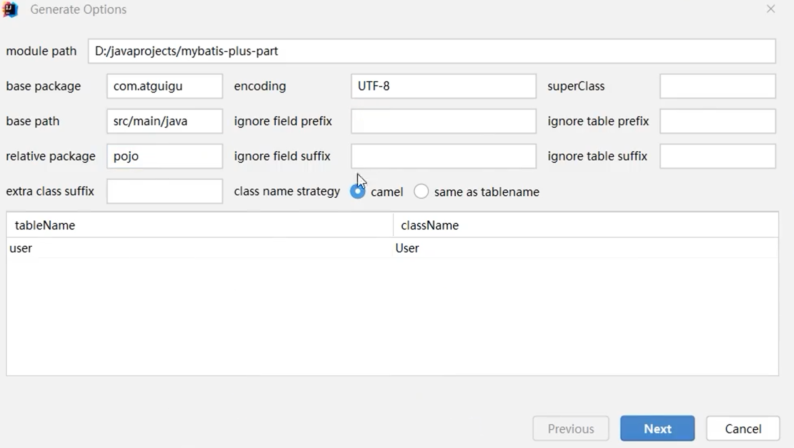
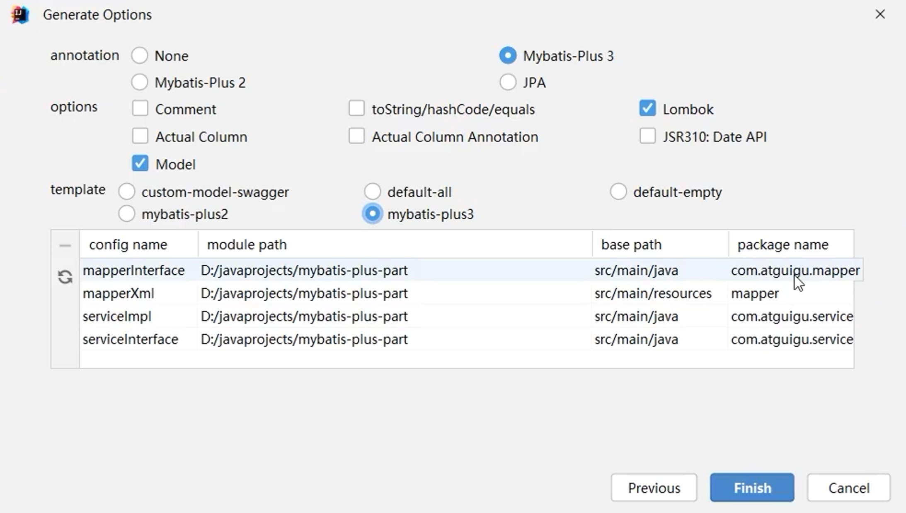

[Mybatis官方帮助文档](https://baomidou.com/pages/24112f/#%E7%89%B9%E6%80%A7)

# 一、MyBatis-Plus快速入门

自动生成单表的CRUD功能

提供丰富的条件拼接方式

全自动ORM类型的持久层框架

步骤：

1. 导入相关依赖 mybatis-plus spring-boot-jdbc mysqlconnection druid等
2. 编写配置yml的配置文件，配置连接池的相关信息
3. 创建package-mapper,让mapper接口继承BaseMapper,这时候mapper接口自动有了单表的CRUD方法和xml的相关实现
4. 在Main入口类的添加@MapperScan扫描mapper所在的包
5. 在需要xxMapper类的地方直接装配使用即可

# 二、MyBatis-Plus核心功能

### 2.1 基于Mapper接口的CRUD

update修改方法，当属性值为null时，不进行修改

updateById id必须有值，update id可以没有值

**CRUD****: id、list<Integer> listId、Mapper<String,Object>、****Wrapper** 

Insert:如果传入的对象，id为空，会使用雪花算法帮助我们生成

Delete:

Update:改变其余属性值，但是字段id的数据并没有发生什么变化

Select:

多看控制台输出的sql语句；

### 2.2 基于Service接口的CRUD

Service接口同Mapper接口的区别

1. service添加了批量方法
2. service层的方法自动调用事务

想想也是，我们在mapper层定义操作数据库的方法，但是是在Service层进行调用组合的，事务是在Service层，

**多看看官方文档**

### 2.3 分页查询实现

pageHelper使用流程：

1. 导入依赖
2. 设置分页参数
3. 编写sql语句，不要以;结尾
4. 结果封装 PageInfo
5. 获取分页数据

原理：后置拦截器，在相应的sql语句后面添加limit

mybatis-plus使用流程：

1. 在Main.class中导入插件
2. 在需要使用到的地方生命page对象 IPage<bean> page = new Page(currentPage,pageSize);
3. 执行查询语句的时候将page对象作为参数传入
4. 相关数据库操作执行完之后，我们可以通过调用page的方法获取分页数据的信息

```Java
@Bean
public MybatisPlusInterceptor mybatisPlusInterceptor(){
    MybatisPlusInterceptor interceptor = new MybatisPlusInterceptor();
    interceptor.addInnerInterceptor(new PaginationInnerInterceptor(DbType.MYSQL));
    return interceptor;
}
```

关于自定义sql语句使用Page插件，主要的不同在于我们需要声明的Mapper接口

```Java
//和普通的mapper接口不同之处在于返回值类型和第一个参数，其他相同
IPage<User> selectPageByAge(IPage<User> page,Integer age);
对应的mapper.xml实现，resultType需要指定实体类。page查询相当于使用list
```

### 2.4 条件构造器使用

queryWrapper.select(String..columns) **查询表中特定的列**

.or（）条件拼接

简单的条件查询、删除、更新我们可以使用mybatis-plus提供的拼接语句，一旦是复杂的sql语句，我们自己写就可以了

在使用update语句时：QueryWrapper和UpdateWrapper的区别：

1. QueryWrapper修改数据时，需要准备修改的实体类；而UpdateWrapper可以直接携带数据 set("列名"，"值")；
2. QueryWrapper不能将值修改为null,而UpdateWrapper修改则没有限制 .set("列名",null);

### 2.5 核心注解使用

帮助我们指定Java实体类与数据库表名的映射

1. @TableName("xxx") 表名注解，标识实体类对应的表，在实体类上使用，如果我们的实体名和表名相同的话（忽略大小写），那么我们可以忽略该注解。
2. @TableId注解 主键注解 作用是标识实体类主键字段；在实体类的属性上面使用，一共用两个属性，value="主键字段名"，type="指定主键类型(主键策略)"，可以为null,默认为IdType.NONE"，可以使用AUTO或者ASSIGN_ID(分配ID)默认实现是雪花算法。

如果我们想要使用AUTO，那么我们的数据库的主键字段一定已经设置了auto_increment自增长；

如果我们使用雪花算法生成id,那么我们的数据库主键类型应该是bigint或者varchar(64),实体类是Long或者String类型

扩展：雪花算法是用于生成唯一ID的算法，生成64位的整数，用于解决分布式系统中生成全局唯一ID的需求。**广泛应用于分布式系统中，如****微服务架构****、****分布式数据库****、****分布式锁****等场景，以满足全局唯一标识的需求。**对于雪花算法生成的数字，我们需要使用Long或者String类型的主键。

1. @TableField 非主键字段注解（value ,exist）

# 三、高级扩展

### 3.1 逻辑删除

1. 数据库和实体类添加逻辑删除字段;可以是布尔类型、整数类型或枚举类型 其中0为未删除；1为已删除
2. 实体类指定逻辑删除字段和属性值
   1. 单一指定：@TableLogic
   2. 全局指定 logic-delete-field:实体类属性
3. 逻辑删除设置之后,就没有了真正的删除语句,删除改为修改语句!

注意：这个没有真正的逻辑删除只存在于mybatis-plus提供的sql语句，我们仍然可以编写和执行自定义的物理删除的sql语句。

### 3.2 乐观锁实现



##### 1.前置知识

**乐观锁****和****悲观锁****是****并发编程****中处理并发访问和资源竞争的两种不同的锁机制。乐观锁和悲观锁都是解决并发问题的思想，并不是具体的技术实现。**

**乐观锁**:乐观锁的基本思想是，认为并发冲突的概率较低，因此不需要提前加锁，而是在数据更新阶段进行冲突检测和处理。乐观锁的核心思想是"先修改，后校验"。在乐观锁的应用中，线程在读取共享资源时不会加锁，而是记录特定的版本信息。当线程准备更新资源时，会先检查该资源的版本信息是否与之前读取的版本信息一致，如果一致则执行更新操作，否则说明有其他线程修改了该资源，需要进行相应的冲突处理。乐观锁通过避免加锁操作，提高了系统的并发性能和吞吐量，但是在并发冲突较为频繁的情况下，乐观锁会导致较多的冲突处理和重试操作。

**悲观锁**：悲观锁的基本思想是，在整个数据访问过程中，将共享资源锁定，以确保其他线程或进程不能同时访问和修改该资源。悲观锁的核心思想是"先保护，再修改"。在悲观锁的应用中，线程在访问共享资源之前会获取到锁，并在整个操作过程中保持锁的状态，阻塞其他线程的访问。只有当前线程完成操作后，才会释放锁，让其他线程继续操作资源。这种锁机制可以确保资源独占性和数据的一致性，但是在高并发环境下，悲观锁的效率相对较低。

##### 版本号乐观锁的实现流程：

1. 每条数据添加一个版本号字段version
2. 取出记录时，获取当前的version
3. 更新时，检查当前记录的版本号是不是数据库最新版本号
4. 如果是，说明没有人修改数据，执行更新操作，set数据更新，version = version + 1;
5. 如果version不对，证明有人已经更改了数据，我们现在的其他数据就是失效数据，更新失败。

##### Mybatis-plus 具体技术实现：

1. 添加OptimisticLockerInnerInterceptor()拦截器
2. 在数据库表中添加int 类型默认值为1的version字段和在实体类的相关属性上添加@Version注解
3. 当使用updateById(id)和update(entity,wrapper)方法时，会自动应用乐观锁机制。

注意：version乐观锁支持的数据类型有:int,Integer,long,Long,Date,Timestamp,LocalDateTime

UPDATE user SET name=?, age=?, email=?, version=? WHERE deleted=0 AND (version = ?)

**在执行更新语句的时候，每次都会判断当前数据的版本号与数据库中的版本号是否一致，如果一致，才进行数据的更新。**

### 3.3 防全表更新和删除

作用: 针对update和delete语句,阻止恶意的全表更新删除

1. 导入插件拦截器 BlockAttackInnerInterceptor()
2. 正常使用update和delete语句即可

阻止行为信息：Cause: com.baomidou.mybatisplus.core.exceptions.MybatisPlusException: Prohibition of table update operation

# 四、MyBatis-Plus代码生成器

### 4.1 MybatisX插件逆向工程





### 4.2 MybatisX快速代码生成

如果Mybatis-plus提供的单表方法不能够满足我们的开发要求，我们可以使用MybatisX插件自动生成Mapper层相关代码；

Alt+Enter

# 学习异常记录：

Caused by: org.springframework.beans.factory.UnsatisfiedDependencyException: Error creating bean with name 'userServiceImpl': Unsatisfied dependency expressed through field 'baseMapper': Error creating bean with name 'userMapper' defined in file [D:\SoftwareDevelop\Idea\IdeaProjects\SSM\mybatis-plus-part\mybatis-plus-wrapper05\target\classes\cn\wangye\mapper\UserMapper.class]: Unsatisfied dependency expressed through bean property 'sqlSessionFactory': Error creating bean with name 'sqlSessionFactory' defined in class path resource 

**翻译**：在文件[D:\SoftwareDevelop\Idea\IdeaProjects\SSM\mybatis-plus-part\mybatis-plus-wrapper05\target\classes\cn\wangye\mapper\ userMapper .class]中创建名称为“userMapper”的bean时出错:通过bean属性“sqlSessionFactory”表示不满意的依赖:创建在类路径资源中定义名称为“sqlSessionFactory”的bean时出错

**原因：出现这种错误通常是XXMapper.xm文件中的要装配的bean出现异常了。**