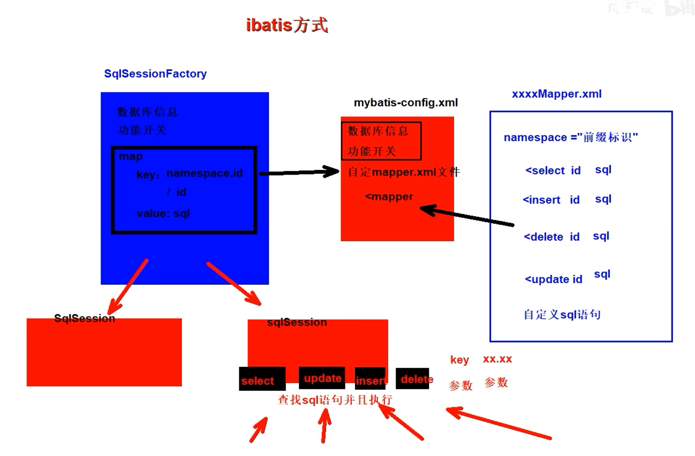
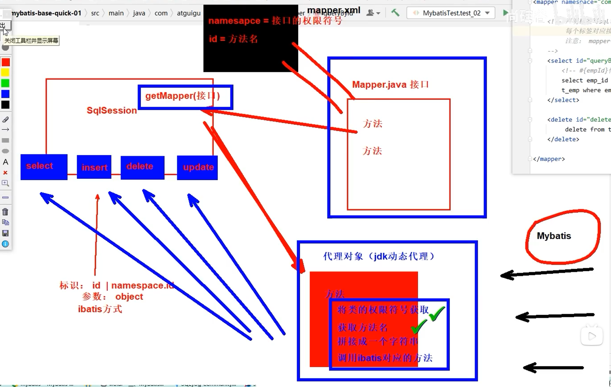
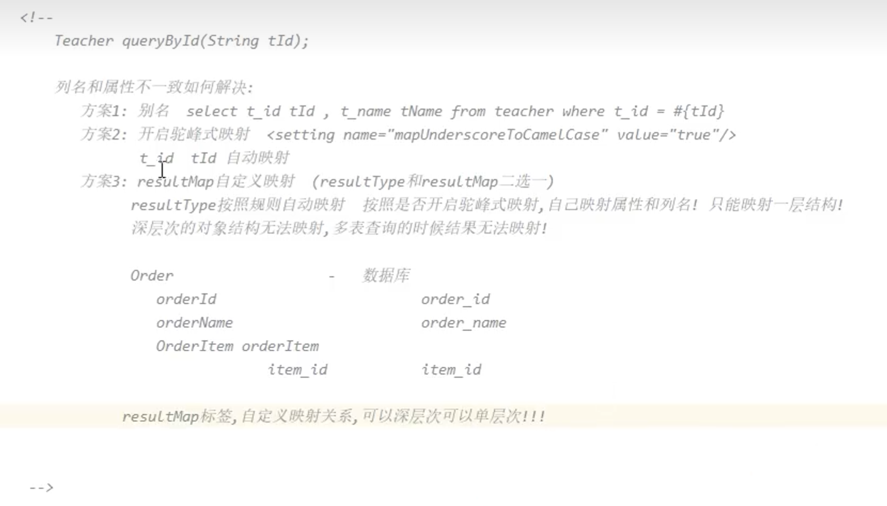
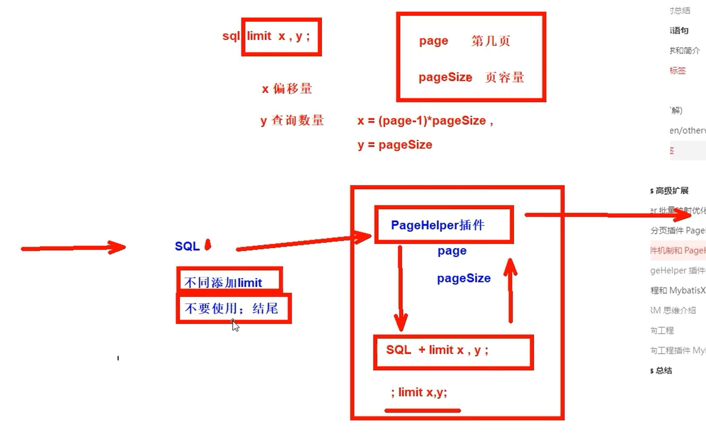
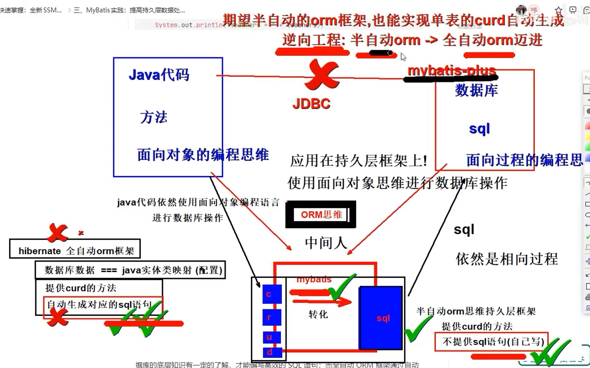
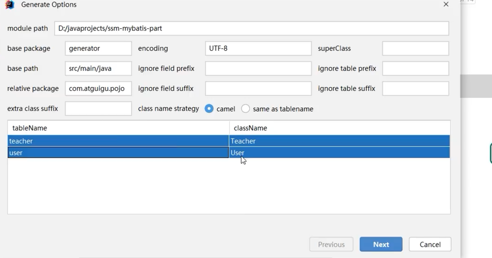
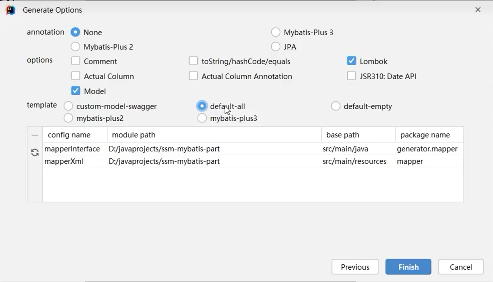

# 一、MyBatis简介

ibatis的运行方式



ibatis模式下的缺点：

1. sql语句标签对应的字符串标识，容易出现问题
2. 向sql语句中传入参数需要进行整合，ibatis只能传递一个参数
3. 返回值问题，返回的都是Object,不能够进行对返回值结果类型的提示。



# 二、MyBatis基本使用

### 2.1 向SQL语句传参

${}与#{}的区别？

**一个是字符串拼接的方式，一个是占位符传参**

通常情况下，我们都是使用#{},进行值的传递；如果我们的业务要求使用动态的列名、表名、容器的话，我们使用${}进行参数传递。和JDBC的操作类似。

### 2.2 数据输入（参数传入）

传入的单个简单类型 key随便写 一般情况下推荐使用参数名！（也可以随便写）

传入的是一个实体对象 key = 属性名即可 ！【gette方法的对应名，不成成员变量】

传入多个简单类型数据 key如何取值？

1. 注解指定 key = 接口文件中形参上的 @Param("value值")
2. mybatis默认机制，mybatis自动将形参转化成相应的形参列表
   1. arg0、arg1、arg2……
   2. param1、param2……

传入Map类型的数据 key = Map的key即可。

注意：Map类型的数据使用场景，如果我们有大量的参数需要传递，但是对应的实体类类型可以使用。使用@Param注解一个一个传入又太麻烦了，所以都封装到Map中,方便获取。

### 2.3 数据输出(返回值设置)

resultType = "全限定符 ｜ 别名 ｜ 如果是返回集合类型，写范型类型即可"

对于返回的单个自定义的实体类型，mybatis默认要求列名和属性名要一致，这样才可以进行实体类的属性映射。

返回map 当没有实体类可以使用接值的时候，我们可以使用map接收数据！ key -->查询的列 value-->查询的值

返回List集合 resultType不需要指定集合类型，只需要指定其泛型即可

起别名的两种方式：

对每一个类起别名

<typeAliases>

  <typeAlias alias="Author" type="domain.blog.Author"/>

  <typeAlias alias="Blog" type="domain.blog.Blog"/>

</typeAliases>

对每一个包起别名

<typeAliases> <package name="domain.blog"/> </typeAliases>

如果全部起别名，对某一个类的别名不太满意，可以使用@Alias注解进行更改（配合使用）

@Alias("author")

public class Author {

​    ...

}

返回主键值：获取插入数据的主键；插入数据的时候同时获取数据库中对应的主键信息 

  自增长的主键: 数据库维护，对于mysql来说是auto_increment

```XML
<!-- 在使用插入是返回的是一个int类型的整数，不需要配置返回结果，因为int是简单类型的-->
<!--  每一个映射文件中的 实体对象的参数，是通过getter方法获取的，不是通过成员变量获取的，mybatis会自动读取我们的pojo对象，调用其中的getter方法；  -->
<!--    useGeneratedKeys="true" //是否想要数据库自动增强的主键值
        keyColumn="emp_id"//主键列的值！！！
        keyProperty="empId"//接收主键列值的属性，我们定义的对象中，谁进行接收返回的id值
        -->
    <insert id="insertEmployee" useGeneratedKeys="true" keyColumn="emp_id" keyProperty="empId">
        insert into t_emp (emp_name, emp_salary)values (#{empName11},#{empSalary})
    </insert>
    <!-- Mybatis是将自增主键的值设置到实体类对象中，而不是以Mapper接口方法返回值的形式返回。 -->
```

非自增长类型的主键：【使用场景：有些数据库不支持自增型的主键或者获取字符串类型的主键】

```XML
<!-- 我们使用 selectKey 来查询 UUID 并设置到 id 字段中。通过 keyProperty 属性来指定查询到的 UUID 赋值给对象中的 id 属性，而 resultType 属性指定了 UUID 的类型为 java.lang.String。 -->
<!-- 需要注意的是，我们将 selectKey 放在了插入语句的前面，这是因为 MySQL 在 insert 语句中只支持一个 select 子句，而 selectKey 中查询 UUID 的语句就是一个 select 子句，因此我们需要将其放在前面。  -->
<insert id="insertUser" parameterType="User">
    <selectKey keyProperty="id" resultType="java.lang.String"
        order="BEFORE">
        SELECT UUID() as id
    </selectKey>
    INSERT INTO user (id, username, password) 
    VALUES (
        #{id},
        #{username},
        #{password}
    )
</insert>
<!-- 使用这种方式，我们可以方便地插入 UUID 作为字符串类型主键。当然，还有其他插入方式可以使用，如使用Java代码生成UUID并在类中显式设置值等。需要根据具体应用场景和需求选择合适的插入方式。 -->
```

### 2.4 实体类属性名和数据库字段名保持一致的三种设置方式：

MySql和Java所遵循的命名规则不同，MySql遵循蛇形命名，Java遵循的是驼峰命名。只有列名与属性名一致的时候才可以正确地返回数据

1. sql语句中起别名
2. 开启蛇形命名到驼峰命名的自动映射关系   <setting name="mapUnderscoreToCamelCase" value="true"/>
3. 使用resultMap进行自定义的映射



```XML
<!-- 专门声明一个resultMap设定column到property之间的对应关系 -->
<resultMap id="selectEmployeeByRMResultMap" type="com.atguigu.mybatis.entity.Employee">

  <!-- 使用id标签设置主键列和主键属性之间的对应关系 -->
  <!-- column属性用于指定字段名；property属性用于指定Java实体类属性名 -->
  <id column="emp_id" property="empId"/>

  <!-- 使用result标签设置普通字段和Java实体类属性之间的关系 -->
  <result column="emp_name" property="empName"/>

  <result column="emp_salary" property="empSalary"/>

</resultMap>

<!-- Employee selectEmployeeByRM(Integer empId); -->
<select id="selectEmployeeByRM" resultMap="selectEmployeeByRMResultMap">

  select emp_id,emp_name,emp_salary from t_emp where emp_id=#{empId}

</select>
```

### 2.5 mapperXML标签总结 

MyBatis 的真正强大在于它的语句映射，这是它的魔力所在。由于它的异常强大，映射器的 XML 文件就显得相对简单。如果拿它跟具有相同功能的 JDBC 代码进行对比，你会立即发现省掉了将近 95% 的代码。MyBatis 致力于减少使用成本，让用户能更专注于 SQL 代码。

优点：专注于SQL语句的编写和强大的结果映射功能；

# 三、MyBatis多表映射

**我们的学习目标：**

  多表查询语句使用

  设计实体类对多表映射的关系进行承接

  使用ResultMap完成多表结果映射

数据库中的表对应着Java中的某一实体类，表与表的关系对应着对象与对象的关系。

### 3.1 多表映射概念

MyBatis 思想是：数据库不可能永远是你所想或所需的那个样子。 

我们希望每个数据库都具备良好的第三范式或 BCNF 范式，可惜它们并不都是那样。

 如果能有一种数据库映射模式，完美适配所有的应用程序查询需求，那就太好了，而 ResultMap 就是 MyBatis 给出的完美答案。

多表结果实体类设计小技巧：

  对一，属性中包含对方对象

  对多，属性中包含对方对象集合

  只有真实发生多表查询时，才需要设计和修改实体类，否则不提前设计和修改实体类！

  无论多少张表联查，实体类设计都是两两考虑!

  在查询映射的时候，只需要关注本次查询相关的属性！例如：查询订单和对应的客户，就不要关注客户中的订单集合！【单方向看】

### 3.2 对一映射

```XML
  <!-- 对一关系的核心配置 ->
  <!-- 使用association标签配置“对一”关联关系 -->
  <!-- property属性：在Order类中对一的一端进行引用时使用的属性名 -->
  <!-- javaType属性：一的一端类的全类名 -->
  
  <association property="customer" javaType="customer">
    <!-- 配置Customer类的属性和字段名之间的对应关系 -->
    <id column="customer_id" property="customerId"/>
    <result column="customer_name" property="customerName"/>
  </association>
```

### 3.3 对多映射

```XML
  <!-- 对多关系的核心配置 ->
  <!-- collection标签：映射“对多”的关联关系 -->
  <!-- property属性：在Customer类中，关联“多”的一端的属性名 -->
  <!-- ofType属性：集合属性中元素的类型 -->
  <collection property="orderList" ofType="order">
    <!-- 映射Order的属性 -->
    <id column="order_id" property="orderId"/>
    <result column="order_name" property="orderName"/>
  </collection>
```

### 3.4 多表映射优化

开启深层次的自动映射

```XML
<!--开启resultMap自动映射 -->
<setting name="autoMappingBehavior" value="FULL"/>
```

我们可以将autoMappingBehavior设置为FULL,进行多表resultMap映射的时候，可以省略符合列和属性命名映射规则（列名=属性名，或者开启驼峰映射也可以自定映射）的result标签！只需要书写id主键映射；

# 四、MyBatis动态语句

### 4.1 动态语句需求和简介

多条件查询 目前解决方法：根据输入条件的数量和类型去执行对应的方法，重载机制或者sql语句拼接机制 **麻烦**

大于号>：&gt; 

小于号<: &lt;

整个SQL语句是动态生成的，Mybatis会先根据条件进行判断，拼接对应的字句，之后执行sql语句的时候已经的完全生成拼接好的了。

### 4.2 if 和 where标签

### 4.3 set标签

### 4.4 trim标签（了解）

技巧：用好前后缀添加和前后缀代替即可；

使用trim标签控制条件部分两端是否包含某些字符

\- prefix属性：指定要动态添加的前缀 - suffix属性：指定要动态添加的后缀 - prefixOverrides属性：指定要动态去掉的前缀，使用“|”分隔有可能的多个值 - suffixOverrides属性：指定要动态去掉的后缀，使用“|”分隔有可能的多个值

### 4.5 choose/when/otherwise标签

多条件分支，只执行一个，相当于if...else if...esle if..else

 choose（大标签，嵌套when和otherwise）-->when-->when -->when-->otherwise(可以写成1=1恒成立的形式)

### 4.6 foreach标签

只要能够写出来正常的批量操作语句，那么就可以正确使用foreach标签了；

批量插入、删除、查询本质上是一条SQL语句，而实现批量更新则需要多条SQL语句拼起来，用分号分开。也就是一次性发送多条SQL语句让数据库执行。此时需要在数据库连接信息的URL地址中设置：

```XML
<property name="url" value="jdbc:mysql://localhost:3306/mybatis-example?allowMultiQueries=true"/>
<!--
    collection属性：要遍历的集合
    item属性：遍历集合的过程中能得到每一个具体对象，在item属性中设置一个名字，将来通过这个名字引用遍历出来的对象
    separator属性：指定当foreach标签的标签体重复拼接字符串时，各个标签体字符串之间的分隔符
    open属性：指定整个循环把字符串拼好后，字符串整体的前面要添加的字符串
    close属性：指定整个循环把字符串拼好后，字符串整体的后面要添加的字符串
    index属性：这里起一个名字，便于后面引用
        遍历List集合，这里能够得到List集合的索引值
        遍历Map集合，这里能够得到Map集合的key
 -->
<select id="queryBatch" resultType="employee">
    select emp_id,emp_name,emp_salary from t_emp
        where emp_id in
    <foreach collection="ids" item="id" open="(" separator="," close=")">
        #{id}
    </foreach>
</select>
```

### 4.7 sql片段

抽取重复的SQL片段

```XML
<!-- 使用sql标签抽取重复出现的SQL片段 -->
<sql id="mySelectSql">
    select emp_id,emp_name,emp_age,emp_salary,emp_gender from t_emp
</sql>
<!-- 使用include标签引用抽取的SQL片段 -->
<include refid="mySelectSql"/>
```

# 五、MyBaits高级扩展

### 5.1 Mapper批量映射优化

Mybatis 允许在指定 Mapper 映射文件时，只指定其所在的包,此时这个包下的所有 Mapper 配置文件将被自动加载、注册，比较方便。

```XML
<mappers>
    <package name="com.atguigu.mapper"/>
</mappers>
<!--注意：这一个包文件的classPath不仅仅是mapper接口的同时也是接口对应的着的XML文件的 -->
```

批量映射的要求：

- Mapper 接口和 Mapper 配置文件名称一致
  - Mapper 接口：EmployeeMapper.java
  - Mapper 配置文件：EmployeeMapper.xml
- Mapper 配置文件放在 Mapper 接口所在的包内
  - 可以将mapperxml文件放在mapper接口所在的包！
  - 可以在sources下创建mapper接口包一致的文件夹结构存放mapperxml文件【在resource下进行,可以单个一层一层地多次创建结构，也可以使用/进行一次创建，一定要是多层路径】

要学会看Java项目打包后的文件结构 clean ---> compile，多打包几次。

### 5.2 插件和分页插件PageHelper



SELECT 字段列表 FROM 表名 LIMIT 起始索引, 查询记录数 ;

注意事项:

• 起始索引从0开始，起始索引 = （查询页码 - 1）* 每页显示记录数。

• 分页查询是数据库的方言，不同的数据库有不同的实现，MySQL中是LIMIT。

• 如果查询的是第一页数据，起始索引可以省略，直接简写为 limit 10。

### 5.3 逆向工程和MybatisX插件 





