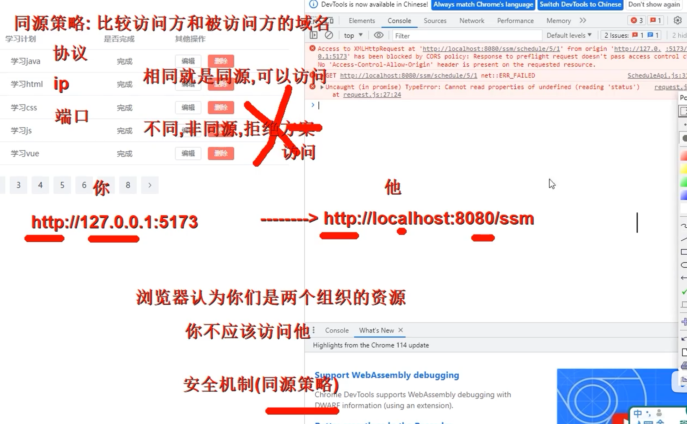

# 一、SSM整合理解

SSM整合就是通过编写配置文件，让SpringIOC容器管理整个项目；

### SSM整合核心问题明确

##### 第一问：SSM整合需要几个IOC容器？

一般是两个容器，方便我们对SSM项目各个部分进行管理和解耦合。

##### 第二问：每一个IOC容器对应哪些类型组件？

Web容器

Controller

SpringMVC

web.xml配置

Root容器

Service -- tx -- aop

DataSource -- mapper mybatis-config.xml 

##### 第三问：IOC容器之间关系和调用方向？

WebIOC容器和RootIOC容器是父子关系，其中WebIOC容器是子容器，RootIOC容器是父容器

WebIOC --> rootIOC 单向调用关系

##### 第四问：具体多少配置类以及对应容器关系？

三个配置

**WebJavaConfig** 控制层 Controlller MVC web容器 

**ServiceJavaConfig** 业务层 service aop tx  root容器 

**MapperjavaConfig** 持久层 mapper mybatis DataSource  root容器 

##### 第五问：IOC初始化方式和配置位置？

web.xml和配置类，一般使用配置类。

SpringMVCInit会在项目启动的时候自动加载MyConfig SpringMVC容器

# 二、SSM整合配置实战

 

# 三、《任务列表案例》前端程序搭建和运行

 

# 四、《任务列表案例》后端程序实现和测试

CORS跨域请求问题：

Access to XMLHttpRequest at 'http://localhost:8080/ssm/schedule/5/1' from origin 'http://127.0.0.1:5173' has been blocked by CORS policy: Response to preflight request doesn't pass access control check: No 'Access-Control-Allow-Origin' header is present on the requested resource.

解决：CrossOrigin//允许其他源访问我们的controller 可以加在类和方法上

# 异常

具体原因目前仍然不清楚，知道部分原因了，idea的报错有问题

org.springframework.beans.factory.UnsatisfiedDependencyException:

Error creating bean with name 'empServiceImpl': Unsatisfied dependency

expressed through field 'employeeMapper': No qualifying bean of type

'cn.wangye.mapper.EmployeeMapper' available: expected at least 1 bean

which qualifies as autowire candidate. Dependency annotations:

{@org.springframework.beans.factory.annotation.Autowired(required=true)}