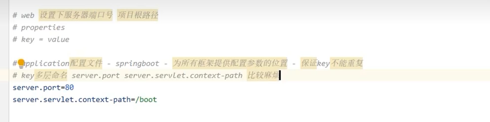
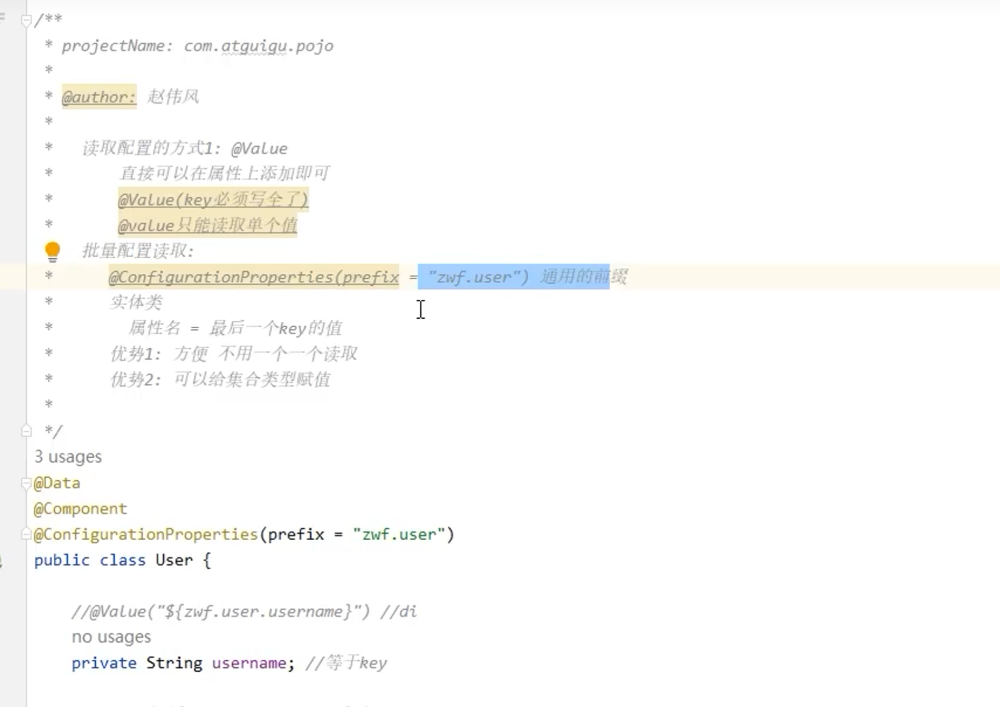
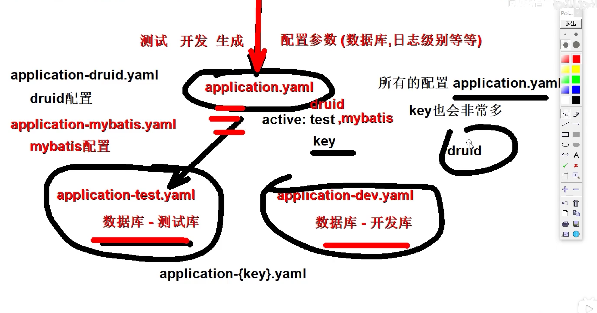
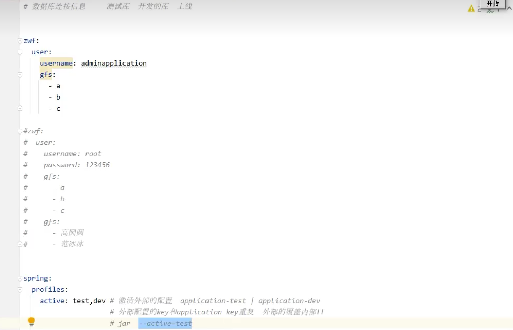
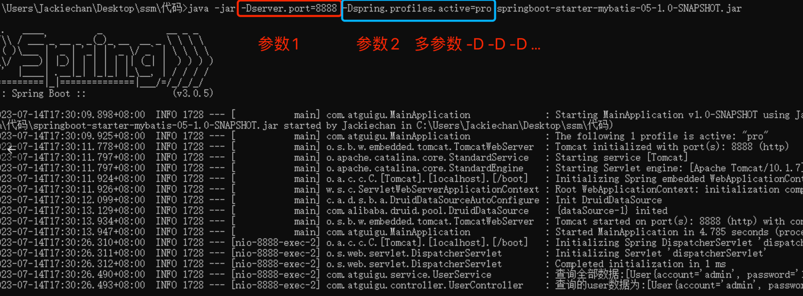

SpringBoot是Springframework框架适应微服务的产品

单体项目 整合文件1次

微服务 拆分几个服务，写几次整合文件

SpringBoot快速搭建项目,少些甚至不写配置文件【快速启动框架】

约定大约配置，只要按照我们的规则编写程序，就有可能不写配置文件

系统要求：

Maven 3.6.3or later

Tomcat 10.0+

JDK 17+

Servlet 9.0.0 +

SpirngBoot版本 3.0.5

# 一、SpringBoot3介绍

SpringBoot 帮我们简单、快速地创建一个独立的、生产级别的 Spring 应用（说明：SpringBoot底层是Spring），大多数 SpringBoot 应用只需要编写少量配置即可快速整合 Spring 平台以及第三方技术！

SpringBoot的主要目标是：

- 为所有 Spring 开发提供更快速、可广泛访问的入门体验。
- 开箱即用，设置合理的默认值，但是也可以根据需求进行适当的调整。
- 提供一系列大型项目通用的非功能性程序（如嵌入式服务器、安全性、指标、运行检查等）。
- 约定大于配置，基本不需要主动编写配置类、也不需要 XML 配置文件。

**总结：简化开发，简化配置，简化整合，简化部署，简化监控，简化运维。**

```Java
package com.atguigu;

import org.springframework.boot.SpringApplication;
import org.springframework.boot.autoconfigure.SpringBootApplication;

/**
 * @SpringBootApplication是一个特殊的注解，用于标识一个Spring Boot应用程序的入口类。它的主要作用是将三个常用注解组合在一起，简化了配置的过程。
 *
 * 具体而言，@SpringBootApplication注解包含以下三个注解的功能：
 *     @Configuration：将该类标识为应用程序的配置类。它允许使用Java代码定义和配置Bean。
 *     @EnableAutoConfiguration：启用Spring Boot的自动配置机制。它根据项目的依赖项自动配置Spring应用程序的行为。自动配置根据类路径、注解和配置属性等条件来决定要使用的功能和配置。
 *     @ComponentScan：自动扫描并加载应用程序中的组件，如控制器、服务、存储库等。它默认扫描@SpringBootApplication注解所在类的包及其子包中的组件。
 *
 * 使用@SpringBootApplication注解，可以将上述三个注解的功能集中在一个注解上，简化了配置文件的编写和组件的加载和扫描过程。它是Spring Boot应用程序的入口点，标识了应用程序的主类，
 * 并告诉Spring Boot在启动时应如何配置和加载应用程序。
 */
@SpringBootApplication
public class MainApplication {

    //SpringApplication.run() 方法是启动 Spring Boot 应用程序的关键步骤。它创建应用程序上下文、
    // 自动配置应用程序、启动应用程序，并处理命令行参数，使应用程序能够运行和提供所需的功能
    public static void main(String[] args) {
        SpringApplication.run(MainApplication.class,args);
    }
}
```

spring boot提供的全部启动器地址：

https://docs.spring.io/spring-boot/docs/current/reference/html/using.html#using.build-systems.starters

命名规范：

- 官方提供的场景：命名为：`spring-boot-starter-*`
- 第三方提供场景：命名为：`*-spring-boot-starter`

# 二、SpringBoot3配置文件

properties、yml、yaml

统一配置管理 规定；

自定义配置管理 引用；



yml、yaml有缩进 

```YAML
wangye:
    info:
        age: 18 #key:空格value
        
        
#使用yaml配置集合 -空格value   
hobby:
    - read
    - run
    - walk 
```







读取数据：

单值读取：@Value

批量读取：@ConfigurationProperties(prefix="前缀")

如果@Value和@ConfigurationProperties同时使用，先检查一遍是否有错误，如果没有错误，读取值时会以先通过@Value进行读取，之后再读取@ConfigurationProperties,如果key相同，会进行覆盖。

# 三、SpringBoot3整合SpringMVC

### 静态资源的处理

在常规的web项目下，我们直接将自己的静态资源放置在webapp目录下，而boot项目并不存在这样的一个文件夹，我们的项目应该放置到一个符合Springboot约定的文件夹下。

**默认的静态资源路径为：**

**· classpath:/META-INF/resources/**

**· classpath:/resources/**

**· classpath:/static/**

**· classpath:/public/**

只要我们的静态资源放置到这些目录中的任意目录，SpringBoot都会帮助我们进行处理。

**自定义路径：**

```YAML
spring: 
    web:
        resource:
            static-location: classpath:/webapp
```

通过我们自定义的设置或着遵循boot的规定，我们都可以直接访问指定路径下的静态资源，比如：我们的资源在wabpp目录下，那么我们访问资源的时候，不需要再请求路径中带上/webapp，就可以直接通过文件名.后缀进行访问。

# 四、SpringBoot3整合Druid数据源

# 五、SpringBoot3整合Mybatis

### Mybatis整合实践

1. 导入依赖 mybatis-spring-boot [mybatis提供的相关依赖]
2. 编写配置类 application.yml 在配置类中主要是设置数据库连接信息、起别名、mapper.xml文件的路径（是mapper-locations: classpath:/mappers/*.xml）以及configuration中的自动驼峰映射、全部映射、log-impl
3. 编写mapper接口和对应的mapper.xml，在springboot项目不需要保持路径结构一致，因为我们是分开进行扫描的。
4. 编写controller类 在controller类中可以直接注入相关的bean
5. 在启动类中通过mapperScan注解扫描mapper接口所在的包。

### 声明式事务整合配置

补一下IOC里面事务的知识点

1.依赖导入

```XML
 <dependency>
    <groupId>org.springframework.boot</groupId>
    <artifactId>spring-boot-starter-jdbc</artifactId>
</dependency>
```

注：SpringBoot项目会自动配置一个 DataSourceTransactionManager，所以我们只需在方法（或者类）加上 @Transactional 注解，就自动纳入 Spring 的事务管理了

```XML
//代码遇到异常会自动进行回滚操作
@Autowired
private UserMapper userMapper;

@Transactional
public int deleteUserById(Integer id) {
    System.out.println("即将执行删除SQL");
    int result = userMapper.deleteById(id);
    System.out.println("删除成功");
    int num = 1/0;
    return result;
}
```

### AOP整合配置

1. 依赖导入

```XML
<dependency>
    <groupId>org.springframework.boot</groupId>
    <artifactId>spring-boot-starter-aop</artifactId>
</dependency>
```

直接使用AOP注解即可，@ApsectJ注解不需要在添加了

```XML
@Component
@Aspect
@Order(5) //value越小优先级越高
public class UserAdvice {
    @Pointcut("execution(* cn.wangye.service.UserService.deleteUserById(Integer))")
    public void deletePointCut(){}
    
    
    @Before(value = "deletePointCut()")
    public void before(JoinPoint joinPoint){
        String className = joinPoint.getTarget().getClass().getSimpleName();
        String methodName = joinPoint.getSignature().getName();
        System.out.println("[前置通知]");
        System.out.println(className+"类的"+methodName+"方法执行了");
    }
}
```

# 六、SpringBoot3项目打包和运行

web项目如何打包运行：

将项目打包成war包，将war包放入tomcat服务器的webapps目录下

这时候，只要tomcat一启动，war就会自动解压，允许外部进行访问；

springboot项目如何打包运行：

spirngboot工程内置服务器软件，我们将项目打包成jar,使用命令去执行java-jar xxx即可允许外部进行访问；

步骤：

1. 下载打包插件

```XML
<!--    SpringBoot应用打包插件-->
<build>
    <plugins>
        <plugin>
            <groupId>org.springframework.boot</groupId>
            <artifactId>spring-boot-maven-plugin</artifactId>
        </plugin>
    </plugins>
</build>
```

1. 执行打包 先clean 再package
2. cmd命令启动和参数说明

java -jar命令用于在Java环境中执行可执行的JAR文件。下面是关于java -jar命令的说明：

```XML
命令格式：java -jar  [选项] [参数] <jar文件名>
```

1. `-D<name>=<value>`：设置系统属性，可以通过`System.getProperty()`方法在应用程序中获取该属性值。例如：`java -jar -Dserver.port=8080 myapp.jar`。
2. `-X`：设置JVM参数，例如内存大小、垃圾回收策略等。常用的选项包括：
   1. `-Xmx<size>`：设置JVM的最大堆内存大小，例如 `-Xmx512m` 表示设置最大堆内存为512MB。
   2. `-Xms<size>`：设置JVM的初始堆内存大小，例如 `-Xms256m` 表示设置初始堆内存为256MB。
3. `-Dspring.profiles.active=<profile>`：指定Spring Boot的激活配置文件，可以通过`application-<profile>.properties`或`application-<profile>.yml`文件来加载相应的配置。例如：`java -jar -Dspring.profiles.active=dev myapp.jar`。

启动和测试：



注意： -D 参数必须要在.jar之前！否则不生效！

ctrl+C终止当前运行的服务