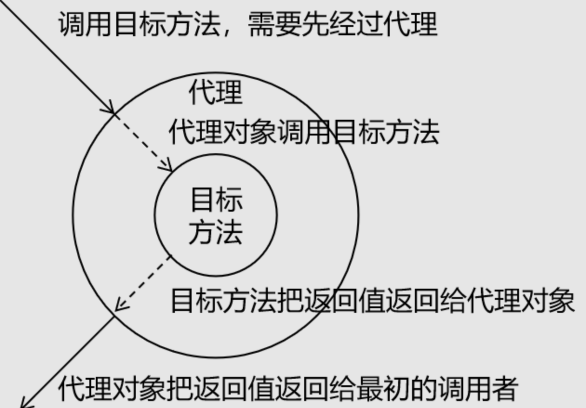

# Spring

单一架构下：

Spring、SpringMAV、Mybatis


简化逻辑开发和业务开发

分布式架构下：

SpringBoot微服务

SpringCloud对微服务进行管理

框架：基础结构，解决特定领域的常见问题，使用框架可以使你专注于特定问题的解决，特殊的业务逻辑，而不需要进行一些基础的配置。

从文件的结构上来看，框架就是jar包 + 配置文件。

框架与第三方jar包的区别就是有无配置文件。框架允许使用者进行特定功能的设置，这一个是在配置文件中进行更改的。

# SpringFramework介绍

Spring和SpringFramework的区别：

Spring是技术栈，是一套全家桶

SpringFramework是整个Spring家族的基础,整个家族是在Spring的基础上发展起来的。

 

# SpringloC 容器和核心概念

框架的学习重心在配置文件，并不是框架帮你把事情做了，而是下命令，让组件帮你做事情。如何下达命令：写好配置文件。

组件：可以复用的java对象，组件一定是对象，但是对象不一定是组件。（vue不太一样）

## SpringloC容器和容器实现


BeanFactory是最基本的接口，规定了SpringloC容器最基本的规范

ApplicationContext实现了BeanFactory接口，并做了一些扩展动作

ClassPathXmlApplicationContext、FileSystemApplicationContext、WebApplicationContext、AnnotationConfigApplicaionContext是对ApplicationContext的具体实现类，我们一般直接使用的是这四个类。


# Spring loC实践和应用


配置文件.xml形式的：

一个配置文件，代表一个组件

## 基于xml的loC、di的Spring

### loC配置


**普通无参构造函数实例化：**

在xml文件中使用<bean>标签进行配置，里面的属性有id和class

**静态工厂方法实例化：**

(**静态**工厂类如何声明工厂方法进行ioc配置)

一样书写bean标签，id是唯一标识、class是工厂类的全限定，追加一个标签，factory-method

**非静态工厂方法实例化：**

总结：

### di配置

通过配置文件，实现IoC容器中Bean之间的引用（依赖注入DI配置）

主要涉及注入场景：基于**构造函数的依赖注入**和基于**Setter()方法**的依赖注入。

SpringIoc容器是一个高级容器，内部会有缓存动作！Ioc容器会先创建对象ioc,之后再进行属性赋值操作。即分两步进行，先创建ioc，之后再注入DI的关系

直接类型用value,引用类型用ref

构造函数的依赖注入：<constructor-arg> index name value||ref

setter()方法的依赖注入<property> name value||ref **name是必需的，本质上是找setter方法**

需要特别注意：引用其他bean，使用ref属性。直接注入基本类型值，使用value属性。

### Ioc容器的创建和使用


### 扩展组件的周期方法

周期方法：到了对应的时间，节点就会主动被调用的方法！

在使用周期方法时，我们只要等待和编写对应的业务逻辑即可！

**周期方法要求： 方法命名随意，但是要求方法必须是 public void 无形参列表**


## 扩展作用域配置

Bean标签内所有的信息会转化成BeanDefinition对象


scope作用域：在反射实例化的过程中控制对应的组件对象是单例还是多例

作用域取值：singleton、propotype

如果是Web容器中会有两个额外的取值：request、session

单例是不管getBean多少次，获取的都是一个组件对象

多例是每getBean一次，获取到的都是一个新的对象

## 扩展FactoryBean类使用

标准化工厂 —— FactoryBean接口

作用：帮助我们简化实例工厂类的配置过程，如果我们的实例工厂类实现FactoryBean接口，将原先的创建过程存储在FactoryBean 的getObject方法中即可，那么我们在xml文件中仅仅只需要在bean中配置id和class即可！

使用场景：

1. 代理类的创建
2. 整合第三方库
3. 复杂对象的实例化 

如果我们使用工厂类，对于想要对生产的产品进行自定义设置，就需要在工厂类中设置set方法，在xml文件中用<property>标签进行参数的传递。

```Java
//根据声明FactoryBean的id,获取的是getObject方法返回的对象，要注意接收的类型    
HappyMachine happyMachine = iocContainer.getBean("happyMachine7",HappyMachine.class)；
```

**FactoryBean和BeanFactory的区别：**

FactoryBean 是 Spring 中一种特殊的 bean，可以在 getObject() 工厂方法自定义的逻辑创建Bean！是一种能够生产其他 Bean 的 Bean。FactoryBean 在容器启动时被创建，而在实际使用时则是通过调用 getObject() 方法来得到其所生产的 Bean。因此，FactoryBean 可以自定义任何所需的初始化逻辑，生产出一些定制化的 bean。一般情况下，整合第三方框架，都是通过定义FactoryBean实现！！！

BeanFactory 是 Spring 框架的基础，其作为一个顶级接口定义了容器的基本行为，例如管理 bean 的生命周期、配置文件的加载和解析、bean 的装配和依赖注入等。BeanFactory 接口提供了访问 bean 的方式，例如 getBean() 方法获取指定的 bean 实例。它可以从不同的来源（例如 Mysql 数据库、XML 文件、Java 配置类等）获取 bean 定义，并将其转换为 bean 实例。同时，BeanFactory 还包含很多子类（例如，ApplicationContext 接口）提供了额外的强大功能。

总的来说，FactoryBean 和 BeanFactory 的区别主要在于前者是用于创建 bean 的接口，它提供了更加灵活的初始化定制功能，而后者是用于管理 bean 的框架基础接口，提供了基本的容器功能和 bean 生命周期管理。

**补充****泛型****的知识点**

## 三层架构组件管理介绍jdbctemplate使用

```Java
//RowMapper参数是什么玩意
/*
接口可以直接进行new 吗？
RowMapper是一个接口，我们直接new它就可以了，对于其中方法我们必须进行实现；

*/

public void testDQLForObject(){
    ClassPathXmlApplicationContext context = new ClassPathXmlApplicationContext("spring-ioc-xml-exercise.xml");
    JdbcTemplate jdbcTemplate = context.getBean("jdbcTemplate", JdbcTemplate.class);
    String sql = "select * from students where id =?;";
//如果我们这里使用RowMapper，需要自己去实现RowMapper接口中的方法，完成查询到的数据库列与Java类的映射关系
    jdbcTemplate.queryForObject(sql, new RowMapper<Student>() {
        @Override
        public Student mapRow(ResultSet rs, int rowNum) throws SQLException {
        //rs是结果集，rowNum是行数，不重要，不需要关注；
            Student student = new Student();
            student.setId(rs.getInt("id"));
            student.setName(rs.getString("name"));
            student.setGender(rs.getString("gender"));
            student.setAge(rs.getInt("age"));
            student.setClasses(rs.getString("class"));
            System.out.println(student);
            return student;
        }
    }, 9);
    //使用Spring自己实现好的接口；
    sql="select id,name,gender,age,class as classes from students;";
    List<Student> list = jdbcTemplate.query(sql,new BeanPropertyRowMapper<Student>(Student.class));
    System.out.println(list);
}
```

## 三层架构组件管理实战

问题一：读取配置文件问题

解决：需要在数据的配置文件前面加前缀进行读取，比如：url，不能直接写，而是应该写成test.url

不再自己进行组件的创建，而是在配置文件中进行配置，有Spring,进行我们所需要的对象的创建和传递。

我们在Java中对需要的对象，直接进行全局声明即可，不需要在new了。

## 基于注解方式ioc配置

1. 先在java类中进行标记
2. 在xml中配置扫描范围

配置扫描范围：

1. 普通配置包扫描
2. 指定包，但是排除特定的注解
3. 指定包，指定包含注解生效

## 通过注解如何注入DI


在我们进行DI配置时，会出现这种情况，我们的service方法时一个接口，其中有多个实现类

```Java
@Autowired
private service service;//这种配置的方法会返回多个配置类，我们需要具体地进行指定，完成一对一的配对
//解决方法：
//方法一：
private ServiceImpl serviceImpl//成员变量类型指向一个具体的实现类
//方法二：
@Autowired
@Qualifier(value="serviceImpl")//通过Qualifier注解进行修饰，选中特定类【本意就是修饰】
private service service;
//方法三：优化点 整合注解
@Autowired+@Qualifier(value="serviceImpl") == @Resource(name = "serviceImpl")
/*第三种方法需要单独导包*/
```

## @value注解--赋值操作

基本类型属性赋值

两种方法：

1. 直接赋值操作
2. @value进行外部数据赋值（配置文案中的信息）

## 注解+XML方法实现三层架构综合案例


自己实现过程中的问题：

1. jdbcTemplate.update（）**error:**Mapped class was not specified

原因：实现BeanPropertyRowMapper<Student>(Student.class)忘记传入类型。

1. 为什么会通过@Autowrited，将JdbcTemplate装配到类上

原因：我们一旦在成员变量上面配置了@Autowrited后，IOC容器就会自动在容器里面进行查找并完成装配。

## 配置类和完全注解开发

Spring完全注解配置是指通过 Java配置类代码来配置 Spring 应用程序，使用注解来替代原本在 XML 配置文件中的配置。**相对于 XML 配置，完全注解配置具有更强的类型安全性和更好的可读性。**


## @Bean注解使用、详解


## @import注解使用

## 三种配置类总结

## 测试环境搭建 Spring-test

引入Spring-test jar包

通过注解在测试类上进行标记，通过value属性执行配置类

之后我们就可以直接通过@Autowried注解，在测试类中使用bean了；不需要再获取IOC容器，再进行getBean操作了

# Spring AOP 面向切面编程

### 引出案例

需求：在计算器类中的每一个计算方法前后添加 **日志记录****功能**


对于面向对象编程，我们只能够实现垂直方向的关系，例如继承和实现，对于这种在方法中增加相应代码的操作，我们只能够对方法直接进行修改或者完全重写方法，我们没有办法去实现或者利用方法中的部分代码；**这是****OOP****的缺点。**

我们如果采用完全重写的方法，将产生问题：

1. 代码缺陷

​      对核心业务功能有干扰，导致程序员在开发核心业务功能时分散了精力

​      附加功能代码重复，分散在各个业务功能方法中！**冗余**，且**不方便统一维护**！

1. 解决思路

​      核心就是：解耦。我们需要把附加功能从业务功能代码中抽取出来。

​      将重复的代码统一提取，并且[[动态插入]]到每个业务方法！**【通过约定或者特定的标记，将统一代码插入到业务方法中】**

1. 技术困难

​    解决问题的困难：提取重复附加功能代码到一个类中，可以实现；

​    但是如何将代码插入到各个方法中，我们不会，我们需要引用新技术——代理模式；[invoke]

### 代理模式

##### **代理模式介绍**

​    二十三种设计模式中的一种，属于结构型模式。它的作用就是通过提供一个代理类，让我们在调用目标方法的时候，不再是直接对目标方法进行调用，而是通过代理类间接调用。让不属于目标方法核心逻辑的代码从目标方法中剥离出来——解耦。调用目标方法时先调用代理对象的方法，减少对目标方法的调用和打扰，同时让附加功能集中在一起,方便程序员进行统一维护。

​    无代理场景：


​    有代理场景：



生活中的代理：

​    \- 广告商找大明星拍广告需要经过经纪人

​    \- 合作伙伴找大老板谈合作要约见面时间需要经过秘书

​    \- 房产中介是买卖双方的代理

​    \- 太监是大臣和皇上之间的代理

相关术语：

​     \- 代理：将非核心逻辑剥离出来以后，封装这些非核心逻辑的类、对象、方法。(中介)

​         \- 动词：指做代理这个动作，或这项工作

​         \- 名词：扮演代理这个角色的类、对象、方法

​    \- 目标：**被代理** -- 核心逻辑代码的类、对象、方法。(房东)

代理在开发中实现的方式具体有两种：静态代理，[动态代理技术]

##### **代理总结**

​    **代理方式可以解决附加功能代码干扰核心代码和不方便统一维护的问题！**

​    他主要是将附加功能代码提取到代理中执行，不干扰目标核心代码！

​    但是我们也发现，无论使用静态代理和动态代理(jdk,cglib)，程序员的工作都比较繁琐！需要自己编写代理工厂等！我们在实际开发中，不需要编写代理代码，我们可以使用[Spring AOP]框架，从而简化动态代理的实现！

### 面向切面编程思维（AOP）

AOP可以说是OOP（Object Oriented Programming，面向对象编程）的补充和完善。OOP引入封装、继承、多态等概念来建立一种对象层次结构，用于模拟公共行为的一个集合。不过OOP允许开发者定义纵向的关系，但并不适合定义横向的关系，例如日志功能。日志代码往往横向地散布在所有对象层次中，而与它对应的对象的核心功能毫无关系对于其他类型的代码，如安全性、异常处理和透明的持续性也都是如此，这种**散布在各处的无关的代码被称为横切**（cross cutting），在OOP设计中，它导致了大量代码的重复，而不利于各个模块的重用。

AOP技术恰恰相反，它利用一种称为"横切"的技术，剖解开封装的对象内部，并将那些影响了多个类的公共行为封装到一个可重用模块，并将其命名为"Aspect"，即切面。所谓"切面"，简单说就是那些与业务无关，却为业务模块所共同调用的逻辑或责任封装起来，便于减少系统的重复代码，降低模块之间的耦合度，并有利于未来的可操作性和可维护性。

**使用****AOP****，可以在不修改原来代码的基础上添加新功能。**

##### AOP术语介绍：

1. 横切关注点：从每一个方法中抽取出来的**同一类非核心业务**。在同一个项目中，我们可以使用多个横切关注点对相关方法进行多个不同方面的增强。对相关方法的增强点，有几个附加功能就有几个横切关注点；
2. 通知方法（增强）每一个横切关注点上的功能是需要通过方法来实现的，这样的方法就叫通知方法；
   1. 前置通知：在被代理的目标方法前执行
   2. 返回通知：在被代理的目标方法成功结束后执行（寿终正寝）（为void也会执行返回通知）
   3. 异常通知：在被代理的目标方法异常结束后执行（死于非命）
   4. 后置通知：在被代理的目标方法最终结束后执行（盖棺定论）（一定会走的）
   5. 环绕通知：使用try...catch...finally结构围绕整个被代理的目标方法，包括上面四种通知对应的所有位置
   6.  **注意：**只要方法执行结束，就会执行后置通知，不管程序报错与否。如果报错会走异常通知，如果正常执行结束，会走返回通知
3. 连接点 joinpoint 【逻辑不是语法定义】可以被切入的代码块（连接点），方法前、方法后、异常时、返回时
4. 切入点 pointcut  被选中的连接点【定位连接点的表达式】用来确定是否选择连接点进行增强
5. 切面 切点+增强的结合，就是连接点表达式加上增强方法形成的一个切面类。**干什么的？【代码核心】**
6. 目标 target 被代理的目标对象
7. 代理 proxy 向目标对象应用通知之后创建的代理对象
8. 织入 weave 指把通知应用到目标上，生成代理对象的过程。可以在编译期织入，也可以在运行期织入，Spring采用后者

AOP把软件系统分为两个部分：核心关注点和横切关注点。业务处理的主要流程是核心关注点，与之关系不大的部分是横切关注点。横切关注点的一个特点是，他们经常发生在核心关注点的多处，而各处基本相似，比如权限认证、日志、事务、异常等。AOP的作用在于分离系统中的各种关注点，将核心关注点和横切关注点分离开来。


**切面：切点+增强；就是将影响多个类的公共行为封装的可重用模块**

## Spring AOP 基于注解方式实现和细节

##### spring实现动态代理的两种方式：


##### 编码过程：


**我们如何在切面类中相应方法的的信息【方法信息，返回结果，异常信息】**

```Java
//通过JoinPoint对象获取目标方法签名对象;方法的签名:一个方法的全部声明信息;签名对象就是signature
//JoinPoint对象在JDK动态代理实际的指向是我们配置切点表达式实现类的接口
        //获取签名对象 通过签名对象我们可以获取方法中的所有信息
        Signature signature = joinPoint.getSignature();
        //获取方法所属的类的信息
        String simpleName = joinPoint.getTarget().getClass().getSimpleName();//目标类的信息
        String declaringTypeName = signature.getDeclaringTypeName());//接口类的信息
        //获取方法名
        String name = signature.getName();
        signature.getDeclaringTypeName());
        //获取访问修饰符
        int modifiers = signature.getModifiers();
        String str = Modifier.toString(modifiers);
        
        //获取参数
        Object[] args = joinPoint.getArgs();
        
        
 TODO:增强方法中获取目标对象的信息：
     1.获取目标方法的信息 全部增强方法中
         形参：(JoinPoint joinPoint) joinPoint包含目标方法的信息
     2.获取返回的结果 返回增强
         @AfterReturning(value = "execution()",
                         returning = "targetMethodReturnValue")
         形参：(JoinPoint joinPoint,Object targetMethodReturnValue)
     3.获取异常信息 异常增强
         @AfterThrowing(value = "execution()",
                        throwing = "targetMethodException")
         形参：(JoinPoint joinPoint,Throwable targetMethodException)
        
        
        
```

##### 切点表达式

匹配切点的规则：


总体 ： （权限访问修饰符 返回值类型）（包名.包名.类名）.方法名（形参类型，形参类型）

注意：包的多层匹配..;包名、方法名的模糊配置*

权限访问修饰符和返回值类型要进行匹配就都匹配，要进行省略就都省略使用*

1. \* *..*.*()
2. Private int xx..*.Service*.*()

##### 统一切点管理

切点表达式的提取和服用

1. 当前类中提取
   1.   定义：写一个无返回值无参数的空方法，注解@Pointcut();

   2.   使用：增强注解中引用切点表达式的方法即可 value="提取的切点表达式的方法名"
2. 创建一个存储切点的类【切点类，也需要被扫描到 Componnet】
   1.   优点：统一维护切点表达式

   2.   定义：相同

   3.   其他类中引用：类的全限定符号.方法名（）；

   4.    

##### 环绕通知：相当于之前的四个事务的统一

```Java
// 使用@Around注解标明环绕通知方法
@Around(value = "com.atguigu.aop.aspect.AtguiguPointCut.transactionPointCut()")
public Object manageTransaction(
    
        // 通过在通知方法形参位置声明ProceedingJoinPoint类型的形参，
        // Spring会将这个类型的对象传给我们
        ProceedingJoinPoint joinPoint) {
    
    // 通过ProceedingJoinPoint对象获取外界调用目标方法时传入的实参数组
    Object[] args = joinPoint.getArgs();
    
    // 通过ProceedingJoinPoint对象获取目标方法的签名对象
    Signature signature = joinPoint.getSignature();
    
    // 通过签名对象获取目标方法的方法名
    String methodName = signature.getName();
    
    // 声明变量用来存储目标方法的返回值
    Object targetMethodReturnValue = null;
    
    try {
    
        // 在目标方法执行前：开启事务（模拟）
        log.debug("[AOP 环绕通知] 开启事务，方法名：" + methodName + "，参数列表：" + Arrays.asList(args));
    
        // 过ProceedingJoinPoint对象调用目标方法
        // 目标方法的返回值一定要返回给外界调用者
        targetMethodReturnValue = joinPoint.proceed(args);
    
        // 在目标方法成功返回后：提交事务（模拟）
        log.debug("[AOP 环绕通知] 提交事务，方法名：" + methodName + "，方法返回值：" + targetMethodReturnValue);
    
    }catch (Throwable e){
    
        // 在目标方法抛异常后：回滚事务（模拟）
        log.debug("[AOP 环绕通知] 回滚事务，方法名：" + methodName + "，异常：" + e.getClass().getName());
    
    }finally {
    
        // 在目标方法最终结束后：释放数据库连接
        log.debug("[AOP 环绕通知] 释放数据库连接，方法名：" + methodName);
    
    }
    
    return targetMethodReturnValue;
}
```

##### 切面优先级设定

相同的目标方法中存在多个切面时，我们需要通过切面的优先级来控制切面的执行顺序；

- 优先级高外边
- 优先级低里面

使用@order注解设置优先级大小：

@Order(value)

value越小，优先级越高

引用场景：

实际开发时，如果有多个切面嵌套的情况，要慎重考虑。例如：如果事务切面优先级高，那么在缓存中命中数据的情况下，事务切面的操作都浪费了。


实际开发时，如果有多个切面嵌套的情况，要慎重考虑。例如：如果事务切面优先级高


##### cglib生效场景

Spring底层实现动态代理有两个机制，分别是：JDK动态代理和CGLIB动态代理

如果我们的切面

我们一旦使用代理之后，放入IOC容器中的将不再是我们的目标类，而是Spring通过JDK或者cglib生成的代理类；而Spring会根据我们的目标类的情况，创建动态代理的方式，如果有接口使用JDK技术，并且用接口进行接值，如果没有接口使用CGLIB技术，使用类进行接值

## Spring AOP 基于XML方式实现（了解）


## Spring AOP对获取Bean的影响 

如果我们使用AOP，目标类有接口，必须使用接口类型接受IoC容器中的代理组件。

原因：如果我们有接口，AOP底层会使用JDK动态代理技术，将我们类生成的代理类放入容器中，而不是我们的目标类，这时候如果我们通过我们的目标类进行getBean的话，会报异常；

# Spring 声明式事务


Spring注解事务管理器的一些设置；事务属性

1. 只读模式 readOnly

只读模式可以提升查询事务的效率！推荐事务中只有查询代码的时候，使用只读模式；

默认：boolean readOnly() default false;

解释：

 一般情况下，都是直接对类进行事务添加的，从而使类下的所有方法都有事务！查询功能的方法可以通过再次添加注解，设置为只读模式，提高效率！

1. 超出时间 timeout

默认:-1 永不超时

设置:timeout = 时间 秒数 超过时间，就会回滚事务和释放资源

如果类上设置事务注解，方法上也设置事务注解，方法会不会生效？？

不会生效：方法上的注解会完全覆盖类上的注解，进行整体的覆盖，而不是根据设置的属性覆盖

1. 异常回滚：
   1.  默认设置，指定发生运行时的市场事务才会回滚；

   2.  指定异常回滚 **rollbackFor = Exception.class**

   3.  指定异常不回滚 noRollbackFor = 在指定的回滚异常范围内，控制某一个异常不回滚；

   4.   一个事务只有两种状态：

   5.  成功：内部不会发生任何问题；

   6.  失败：内部发生运行时异常，事务才算失败，事务才会回滚。（Throwable -- Exception--RuntimeException、IOExceptioin）
2. 隔离级别
   1.    isolation = Isolation.REPEATABLE_READ

只有脏读才是真正的数据错误，幻读和不可重复读都是数据数据一致性的问题。

1. 事务传播行为：多个事务之间互相调用的影响程度
   1.  Propagation = propagation.*REQUIRED（默认值，加入父方法的事务中）*

   2.  Propagation = propagation.*REQUIRES_NEW （自己新建事务，相对于父方法独立）*


**注意：**

​    在同一个类中，对于@Transactional注解的方法调用，事务传播行为不会生效。这是因为Spring框架中使用代理模式实现了事务机制，在同一个类中的方法调用并不经过代理，而是通过对象的方法调用，因此@Transactional注解的设置不会被代理捕获，也就不会产生任何事务传播行为的效果。（**需要通过两个类进行调用**）

 