# 1. SpringMVC简介和体验

### 1.1 简洁

什么是SpringMVC：

全名Spring Web MVC,基于ServletAPI构建的原始Web框架。从一开始就被包含在Spring框架中。

SpringMVC的优点：

- **Spring 家族原生产品**，与IOC容器等基础设施无缝对接
- 表述层各细分领域需要解决的问题**全方位覆盖**，提供**全面解决方案**
- **代码清新简洁**，大幅度提升开发效率
- 内部组件化程度高，可插拔式组件**即插即用**，想要什么功能配置相应组件即可
- **性能卓著**，尤其适合现代大型、超大型互联网项目要求

## 1.2 作用

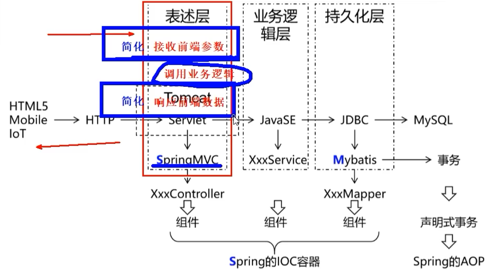

##### 具体作用：

- 请求映射
- 数据输入
- 视图界面
- 请求分发
- 表单回显
- 会话控制
- 过滤拦截
- 异步交互
- 文件上传
- 文件下载
- 数据校验
- 类型转换
- 等等等

SpringMVC是作用于表述层的，能够简化中间Controller层的书写。在Servlet的学习中，我们的Controller层重要做三件事情，接收前端传入的参数、调用业务逻辑代码进行数据处理、将处理后的结果响应给前端。一旦我们使用了SpringMAC将大大简化前端数据的接收和相应前端数据，使我们可以更加专注于业务逻辑代码的开发。

### 1.3 核心组件和调用流程理解

SpringMVC与其他Web框架一样，是围绕前端控制器模式设计的，其中中央Servlet，DispatcherServlet做整体请求处理调度。

与`DispatcherServlet`任何一样`Servlet`，需要根据 Servlet 规范使用，我们需要在 Java 或在`web.xml`进行配置。 反过来，使用 Spring来配置请求映射、视图解析、异常处理等`DispatcherServlet`所需的委托组件。【也就是说，DispatcherServlet需要我们程序员进行单独的配置，我们需要使用web.xml配置使其生效】

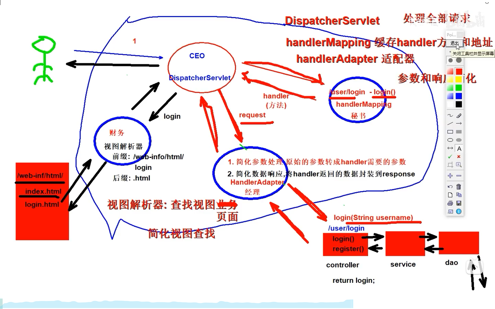

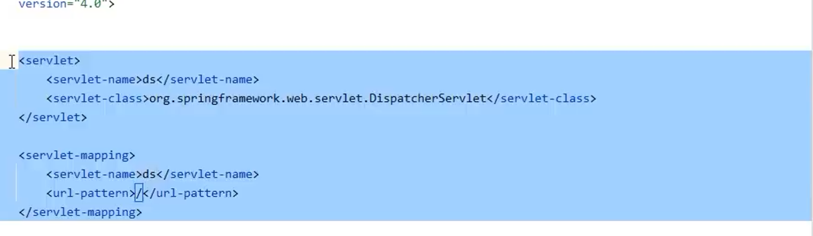

# 2. SpringMVC接收数据

### 2.1 访问路径的配置

同一个请求路径对应到不同的handler方法MVC会如何进行处理 **答：会报错，Servlet.init（）在进行初始化操作的时候，会获取到所有的RequestMapping进行查重操作。**

前端请求的方法和后端允许的方法不一致的时候，会出现**405**错误

**那么method为什么以数组的形式存在，一个萝卜一个坑不就可以了吗？**

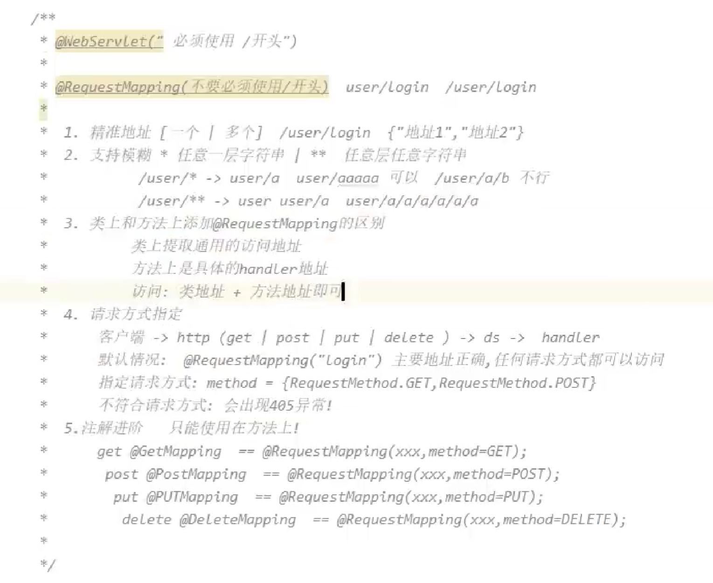

### 2.2 接受参数[param、json、路径参数]

1. 普通接收：

传递参数名同handler方法的形参名一致即可，如果没有向对应的形参传递参数，也不会报错，为传递参数的形参值为null；

1. @RequestParam

通过@RequestParam注解内部的value||name指定请求参数名，如果形参名和请求参数名一致，可以省略！，require = true表示必须传递该参数，不传递报400异常，require = false则表示非必须传递，在设置参数为非必须传递的时候，我们可以使用defaultVaule进行默认值的设置。

1. 一名多值

直接使用List<>集合进行接收，但是必须加上@RequestParam注解，不然会当成普通接收处理，报错

1. 实体类对象

准备一个对应属性和get|set方法的实体类，形参声明为对象参数。此时传递的参数名一定要等于实体类的属性名，不然接收不到数据。

400错误：如果传递的形参列表中的参数不足，并且这时候required=true并且没有进行默认值设置，就会报400错误，参数存在但是没有对应的数据传递。

500错误：如果我们设置了required = false的话，这时候我们没有传递参数，会自动填充默认值，defaultValue的默认值为null.这时候需要使用包装类型，不然会报500的错误，类型不匹配

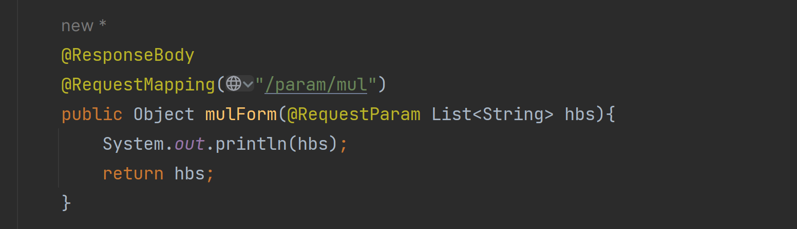

后端接收数据正常，但是没有办法直接向前端返回数据，原因是返回的数据为集合类型，前端页面没有办法接收，需要进行数据的转化。**【就像后端没有办法直接接收****JSON****一样】**

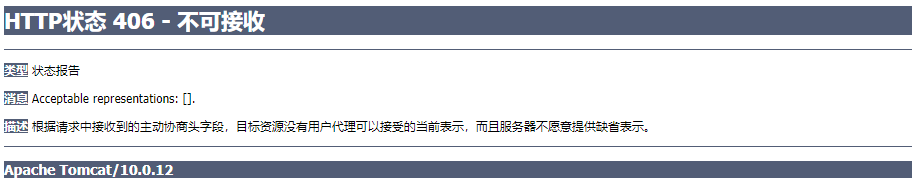

1. 路径参数 1.设计动态路径，handler方法的路径中使用{XXX}进行占位 2.参数接收 在handler的参数列表中使用@PathVariable声明是路径参数;
2. JSON

数据接收：handler(@RequestBody 实体类 对象)

情景：前端向后端传递JOSN 报异常：415 不支持数据类型

原因：Java的原生api，只支持路径参数和param参数 request.getParamter("key")；不支持json参数的接收

解决：1.导入josn处理依赖，jackson-databind   2.handlerAdapter配置josn转化器@EnableWebMvc

@EnableWebMvc做了三件事情：加入handleMapping加入handlerAdapt给handlerAdapter配置JSON配置

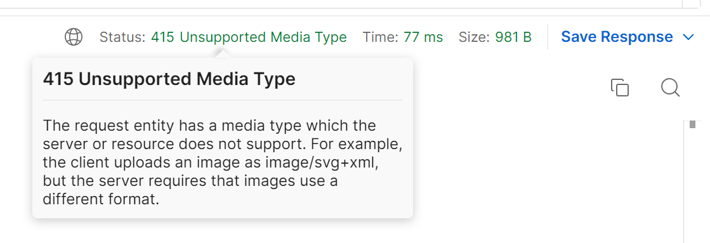

### 2.3 接受Cookie数据

@CookieValue(value="cookie对应的key");

### 2.4 请求头数据

@RequestHeader({"value"、cookie}) 里面的接收参数大小写都可以

### 2.5 原生Api对象操作

在形参列表中直接书写就可以在handler方法使用对应的原生API了

ServletContext作用：

1. 最大的配置文件，我们可以在web.xml文件中进行全局属性的配置，通过ServletContext获取
2. 全局最大的共享域
3. 核心api getRealPath

方案一：根据request、session形参,通过对应的getServletContext（）获取

方案二：程序启动时，会将ServletContext放入到ioc容器中！

```XML
@Autowired//意思是：从ioc容器中获取对应类型实体对象，并自动装配。
private ServletContext servletContext;
```

### 2.6 共享域对象操作

除了原生的方法

SpringMVC为request域提供了四种操作方法

1. mode
2. modeMap
3. map
4. modelAndView

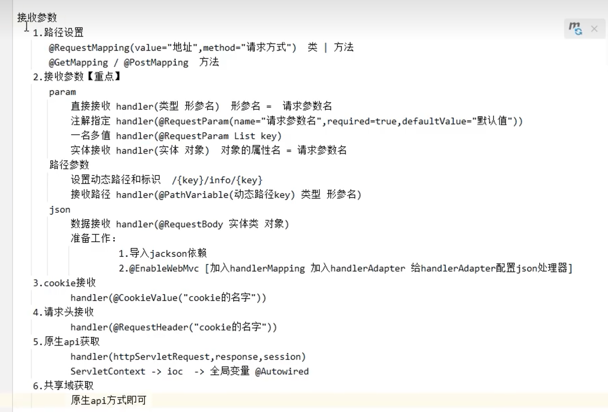

# 3. SpringMVC响应数据

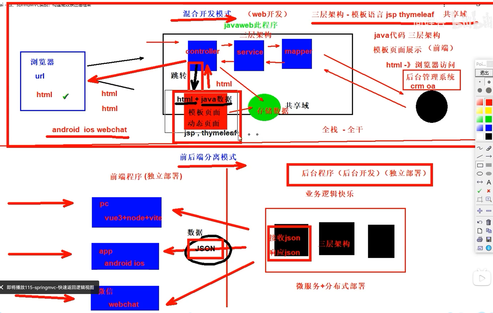

### 3.1 handler方法分析

```XML
@GetMapping 
public Object handler(简化请求参数接收){
     调用业务方法
     返回的结果 （页面跳转，返回数据（json））     
     return 简化响应前端数据; 
}
```

### 3.2 页面跳转控制

开发模式回顾

​    在 Web 开发中，有两种主要的开发模式：前后端分离和混合开发。

​    **前后端分离模式：[重点]**

​      指将前端的界面和后端的业务逻辑通过接口分离开发的一种方式。开发人员使用不同的技术栈和框架，前端开发人员主要负责页面的呈现和用户交互，后端开发人员主要负责业务逻辑和数据存储。前后端通信通过 API 接口完成，数据格式一般使用 JSON 或 XML。前后端分离模式可以提高开发效率，同时也有助于代码重用和维护。

​    **混合开发模式：**

​      指将前端和后端的代码集成在同一个项目中，共享相同的技术栈和框架。这种模式在小型项目中比较常见，可以减少学习成本和部署难度。但是，在大型项目中，这种模式会导致代码耦合性很高，维护和升级难度较大。对于混合开发，我们就需要使用动态页面技术，动态展示Java的共享域数据！！

##### 3.2.1 快速返回模板视图

配置： 需要在让配置类实现WebMvcConfigurer接口，实现configureViewResolvers方法

handler（）方法的返回值类型为String

不要添加@RequestBody注解*（如果写直接返回字符串给前端，不走视图**解析器**）*

返回值 对应中间的视图名称即可

```XML
@Configuration
@EnableWebMvc
@ComponentScan("cn.wangye")
public class MyConfig implements WebMvcConfigurer {
    @Override
    public void configureViewResolvers(ViewResolverRegistry registry) {
        registry.jsp("/WEB-INF/views/",".jsp");
    }
}
```

##### 3.2.2 转发和重定向

handler（）方法的返回值为String

不要添加@RequestBody注解

使用return返回，格式："forward:/路径"

使用return返回，格式："redirect:/路径"

提示：关于return中的路径细节

我们不使用SpringMVC：

转发是项目下的资源跳转 路径：项目下的地址 /jsp/index 忽略applicationContext

重定向是项目下或者项目外的资源 项目下的路径全地址 /applicationContext/jsp/index

使用SpringMVC

重定向项目下的资源地址和转发一样，都不需要加applicatinContext,SpringMVC会帮助我们进行添加。

### 3.3 返回JSON数据（重点）

handler()返回值类型为对象

return 对象实体

使用ResponseBody注解

注意我们接收前端传回来的JOSN数据的时候，在参数列表中写的是@RequestBody()和@RequestHead是一个概念

### 3.4 返回静态资源处理

 在SpringMVC中，为什么我们直接通过url去寻找相关的静态资源会报错

原因：当我们前端发送请求之后，后端会DisPatcherServlet会调用HandlerMapping去处理，HandlerMapping存储的是路径--handler方法的对应关系，此时会返回404错误；

如果我们在配置文件中配置了DefaultServletHandler，这时候handlerRequest会将相关路径进行转发（路径），查找项目下的真实资源（通过转发来放回静态资源）

# 4. RESTFul风格设计和实战

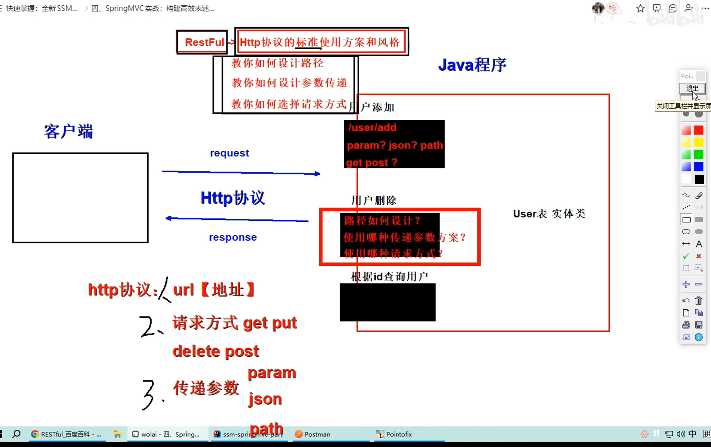

### 4.1 RESTFul风格概述

RESRFul是一种基于HTTP和标准化的设计原则和软件架构风格，用于设计和实现可靠、可扩展和易于集成的Web服务和应用程序。

教你**http协议的最标准的使用方案** url、请求方式、参数设计

URI统一资源表示符 身份证

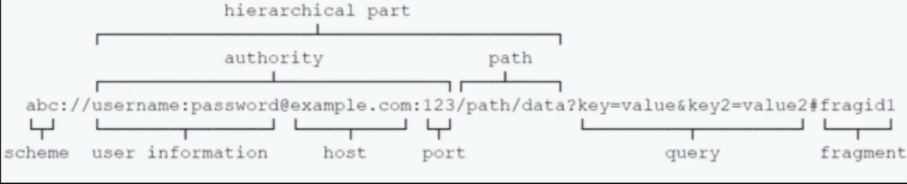

URL统一资源定位符 家庭住址

**URI****和****URL****的区别？**

RESTFul风格规范：

路径设计从原来携带动标识，改成名词，对应资源的唯一标识即可！

使用对应的请求方法进行参数的传递

Post 增加数据

Delete 删除数据

Put 更新数据

Get 获取数据

Get、Delete传递单一数据资源使用路径传参就可以了，注意动态路径的设计和参数获取

Post、Put一般采用param和json进行数据传输

SpringMVC参数相同判断：路径和请求方法完全一致才算相同

# 5. SpringMVC其他扩展

### 5.1 全局异常处理机制

开发过程中不可避免地出现各种异常情况，例如网络连接异常、数据处理异常、空指针异常，不一定都是程序的问题，这时候就需要合理地处理异常，对异常进行有效的调试。

异常处理的两种方式：

编程式异常处理：在程序中一一编写异常的处理机制

声明式异常处理：使用配置文件进行异常的声明

```XML
@RestControllerAdvice//直接返回字符串，这里也分字符串和视图对象，@RestControllerAdvice
public class GlobalExceptionHandler {
    @ExceptionHandler(ArithmeticException.class)【处理什么样的异常】
    public String arithmeticExceptionHandler(ArithmeticException e){
        //这里注册了全局处理ArithmeticException异常的机制
        String message = e.getMessage();
        System.out.println("ArithmeticException"+message);
        return message;
    }

    //如果我们没有定义某一个异常的处理方法，会走其配置的异常处理机制。
    @ExceptionHandler(Exception.class)
    public String ExceptionHandler(Exception e){
        String message = e.getMessage();
        System.out.println("Exception"+message);
        return message;
    }
}
```

### 5.2 拦截器的使用

过滤器 javaweb大粒度

拦截器 SpringMVC颗粒级

HandlerInterceptor接口

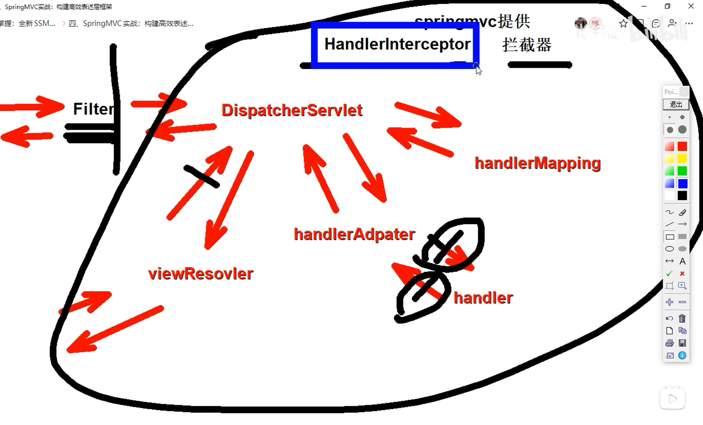

 

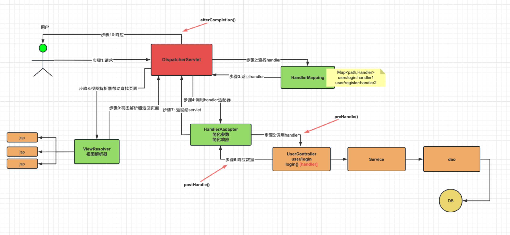

##### 如何使用：

1.配置一个Interceptor拦截器类，让这一个拦截器类实现HandlerInterceptor接口

```XML
public class MyInterceptor implements HandlerInterceptor {
    @Override
    //这个是在Handler方法前进行执行，
    public boolean preHandle(HttpServletRequest request, HttpServletResponse response, Object handler) throws Exception {
        System.out.println("MyInterceptor.preHandle");
        return true;
    }

    @Override
    //在目标handler方法之后执行，handler报错则不执行
    public void postHandle(HttpServletRequest request, HttpServletResponse response, Object handler, ModelAndView modelAndView) throws Exception {
        System.out.println("MyInterceptor.postHandle");
    }

    @Override
    //DispatcherServlet向前端进行相应的时候执行，只要能到拦截器这个流程，就一定会执行
    public void afterCompletion(HttpServletRequest request, HttpServletResponse response, Object handler, Exception ex) throws Exception {
        System.out.println("MyInterceptor.afterCompletion");
    }
}
```

2.在SpingIOC容器的配置类中，通过实现WebMvcConfigurer接口，覆盖addInterceptors()方法

```XML
@Configuration
@EnableWebMvc
@ComponentScan("cn.wangye")
//WebMvcConfigurer WebMvcConfigurer WebMvcConfigurer
public class MyConfig implements WebMvcConfigurer {
    @Override
    public void configureDefaultServletHandling(DefaultServletHandlerConfigurer configurer) {
        configurer.enable();
    }

    @Override
    public void addInterceptors(InterceptorRegistry registry) {
        //匹配规则的编写;
        //如果不填写路径，默认拦截全部路径。可以通过addPathPatterns添加拦截的路径，excludePathPatterns排除路径
        registry.addInterceptor(new MyInterceptor()).addPathPatterns("/user/*").excludePathPatterns("/user/data2");
    }
}
```

多个拦截器执行顺序

1. preHandle() 方法：SpringMVC 会把所有拦截器收集到一起，然后按照配置顺序调用各个 preHandle() 方法。
2. postHandle() 方法：SpringMVC 会把所有拦截器收集到一起，然后按照配置相反的顺序调用各个 postHandle() 方法。
3. afterCompletion() 方法：SpringMVC 会把所有拦截器收集到一起，然后按照配置相反的顺序调用各个 afterCompletion() 方法。

### 5.3 参数校验

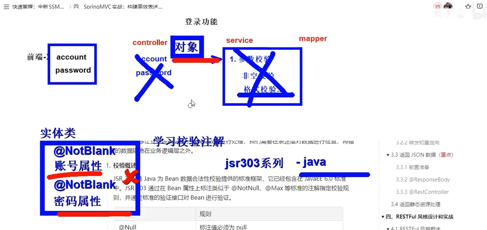

JSR303是Java为**Bean数据合法性**校验提供的标准框架。通过在Bean属性上标注类似于@NotNull、@Max等标注的注解指定校验规则，并通过标准的验证接口对Bean进行验证。

@NotNull 包装类型不为null 【包装类型】

@NotEmpty 集合类型长度大于0【集合】

@NotBlank（字符串，不为null,且不为" "字符串）【字符串】

符合校验规则的参数就接收，不符合的参数就报错。

使用校验注解的步骤：

1. 实体列属性添加校验注解
2. handler(@validataed实体类 对象)

细节：param | json 校验注解都有效果

```Java
    @RequestMapping("register")
    public Object register(@RequestBody @Validated User user,BindingResult result) {
        if (result.hasErrors()){
            System.out.println("错误");
            String errorMsg = result.getFieldError().toString();
            
            return errorMsg;
        }
        System.out.println("正常");
        return user;
    }
} 
```